# React Flow – Update Profile Field

A React Flow application with custom nodes for updating profile fields. Built with React, Vite, TipTap, and Turn.io Expression Language integration.

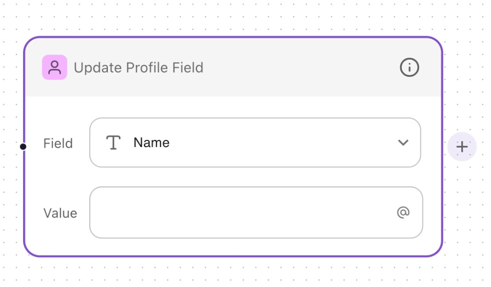

## Architecture

### Atomic design component structure
The UI is built using **atomic design**, with components organized as atoms → molecules → organisms:

- **Atoms** – Small, reusable primitives (e.g. `AtButton`, `ChevronButton`, `ClearButton`, `FieldTypeIcon`, `ProfileHeaderIcons`)
- **Molecules** – Combinations of atoms (e.g. `SuggestionItem`, `InputSelectField`, `TiptapValueField`)
- **Organisms** – Full sections or nodes (e.g. `Card`, `CustomEdge`, `ExpressionSuggestionList`)

This structure promotes reusability and keeps components focused and testable.

## Features

### Basic React Flow configuration
- Custom node type for the "Update Profile Field" card
- Custom edges with purple styling
- Add-node (+) button to create new nodes below the current one

  A custom **add (+) button** is integrated into each card node. Clicking it creates a new node below the current one and connects them with an edge. Nodes can be chained to build flows.

  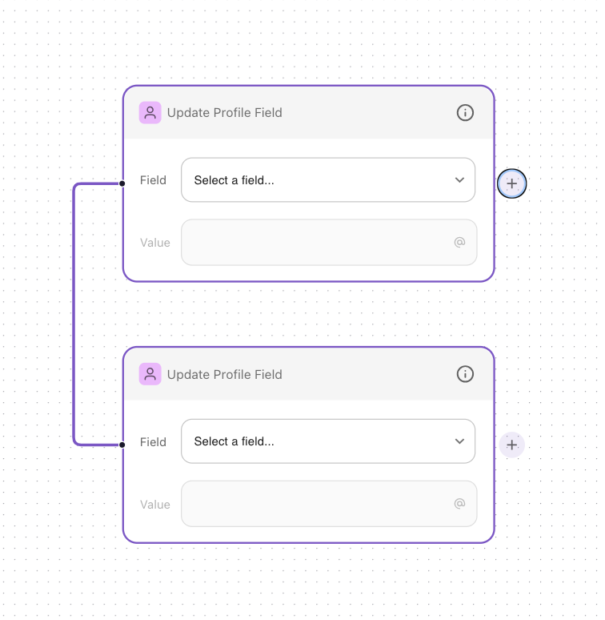
- Connection handles on the left for flow edges

### Field input
- **Field name types** – Includes profile fields such as Name, Surname, Location, Opted In, Language, Birthday, Is Blocked, and custom fields
- **Languages** – ISO 639-3 languages fetched from `src/lib/languageOptions.js`

  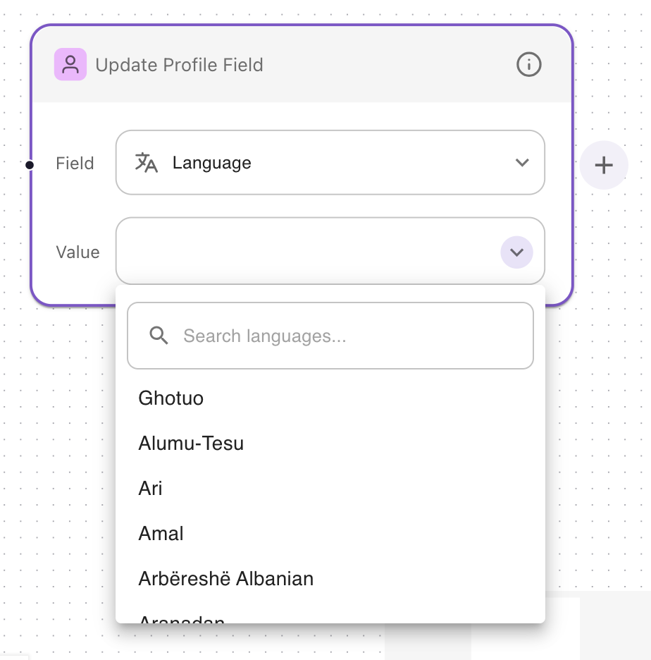
- **Searchable** – Field type is searchable in the input field
- **Icons** – Field type icons provided by Turn.io, located in `src/assets/field-types/`
  - Type_01-STRING.svg (Text)
  - Translate_01-LANGUAGE.svg (Language)
  - Toggle_03Right-BOOLEAN.svg (Boolean)
  - Dotpoints_01-ENUM.svg (Enum)
  - CalendarDate-DATETIME.svg (Date)
  - Calculator-INTEGER.svg (Integer)
  - AtSign.svg (@ expression button)

### Value field
- **TipTap** – WYSIWYG editor for rich text input

  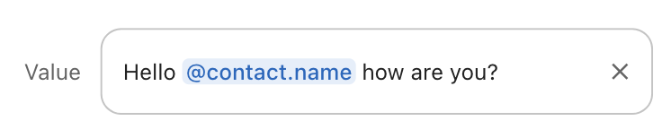
- **Not editable by default** – Value field is disabled until a field is selected

  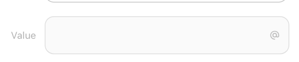
- **Turn.io Expression Language** – Integrated expression suggestions:

  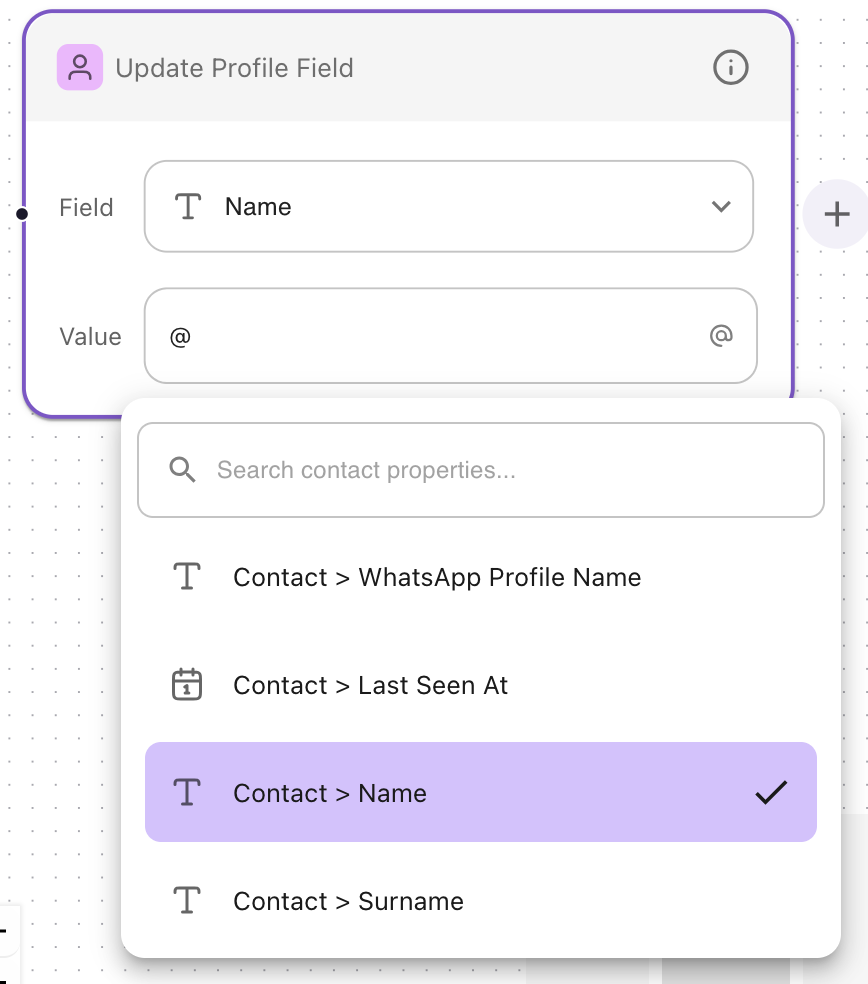
  - Schema defined in `src/lib/turnioExpressionSchema.js` using Turn.io documentation
  - Mock data in `src/lib/expressionSuggestions.js` (API key placeholder)
  - Business logic in `src/Components/molecules/ExpressionSuggestionList.jsx`
  - Typing `@` in the input or clicking the `@` button displays the expressions list

    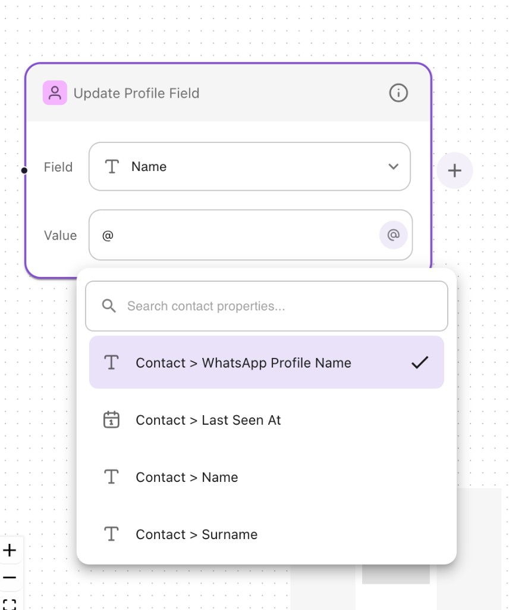

### Field types
- **Text** – No dropdown (⬇️) button; inline text editing with TipTap
- **Date / Boolean / Enum** – Dropdown (⬇️) button present for picking values

  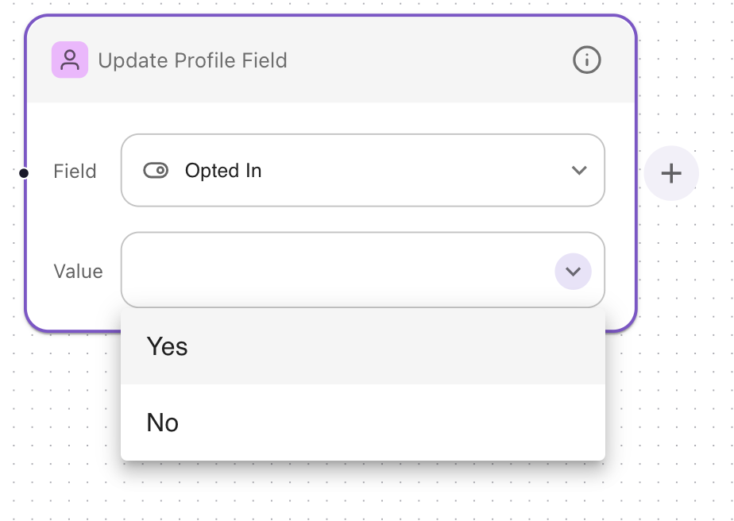
- **Clear button** – When a value is selected, an ✕ button appears to clear the input; the field is not editable while a value is set

  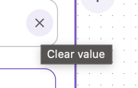

### Saving
- **Submit button** – When the value field is populated (for Date/Boolean/Enum types), a Submit button appears to save the values
- **Dynamic updates** – When a new selection is made in the card, the saved value updates with the new data

<table>
<tr>
<td>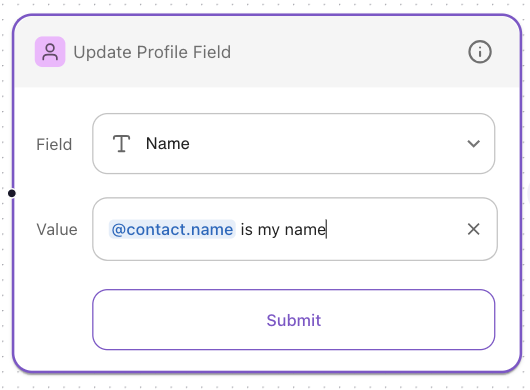</td>
<td>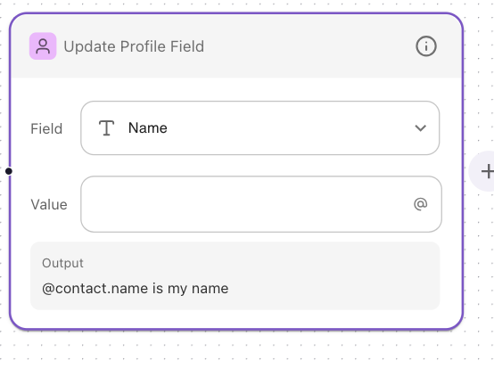</td>
</tr>
</table>

### Icons
- Field type icons downloaded from Google Drive and included in `src/assets/field-types/`

## Project structure

```
src/
├── Components/
│   ├── atoms/                             # Atomic design – reusable primitives
│   │   ├── AtButton.jsx                   # @ expression button
│   │   ├── ChevronButton.jsx
│   │   ├── ClearButton.jsx
│   │   ├── FieldTypeIcons.jsx
│   │   └── ProfileHeaderIcons.jsx
│   ├── molecules/                         # Atomic design – composed components
│   │   ├── SuggestionItem.jsx             # Suggestion row (icon + label + check)
│   │   ├── InputSelectField.jsx           # Field dropdown
│   │   ├── TiptapValueField.jsx           # Value editor (TipTap + expressions)
│   │   ├── ValueFieldWithPicker.jsx       # Value field with Date/Boolean/Enum pickers
│   │   └── ...
│   └── organisms/                         # Atomic design – full sections
│       ├── Card.jsx                       # Custom node component
│       ├── CustomEdge.jsx
│       └── ExpressionSuggestionList.jsx   # Expression @ suggestions popover
├── lib/
│   ├── expressionSuggestions.js          # Mock expression data
│   ├── languageOptions.js                # ISO 639-3 language options
│   └── turnioExpressionSchema.js         # Turn.io expression schema
└── assets/
    ├── field-types/                      # Turn.io field type icons
    └── images/                           # README documentation screenshots
```

## Getting started

```bash
npm install
npm run dev
```

## Tech stack

- React + Vite
- [@xyflow/react](https://reactflow.dev/) – React Flow
- [TipTap](https://tiptap.dev/) – Rich text editor
- MUI (Material UI) – Select, buttons, date picker
- Turn.io Expression Language – Profile field expressions
